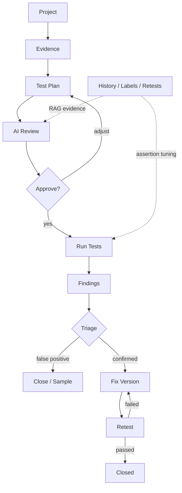

# IDOR Workbench

## Workflow



IDOR Workbench 是一个面向测开和安全测试团队的越权测试工作台。它把项目配置、角色账号、接口导入、浏览器录制、执行计划、业务场景、接口执行、前端拦截检测、AI 审查和报告产物放在同一条可追踪链路里。

核心原则：规则引擎负责稳定生成和执行，AI 负责理解、审查、解释和辅助修正。AI 不应该悄悄替代用户搭业务场景，也不应该绕过后端规则校验直接污染测试计划。

## 启动

```powershell
pip install -r requirements.txt
python -m playwright install chromium
python -m uvicorn idor_workbench.views.api:app --host 127.0.0.1 --port 8001
```

访问：

```text
http://127.0.0.1:8001
```

如果本机或内网测试环境被系统代理影响，目标系统访问链路已经在 `httpx` 客户端上关闭环境代理：

- API 执行：`idor_workbench/domains/idor/execution.py`
- 前端登录/探针：`idor_workbench/domains/idor/frontend_probe.py`
- 场景准备 HTTP 适配器：`idor_workbench/domains/idor/runner.py`

## 总体数据流

```text
浏览器 UI
  |
  |  collectProject()
  v
FastAPI: idor_workbench.views.api
  |
  |-- SQLite: data/workbench.sqlite3
  |     保存项目索引、运行历史、上传文件索引、用户 AI 设置
  |
  |-- 项目目录: data/projects/<project_id>/
  |     project.json
  |     test_plan.json
  |     generated_config.py
  |     run_results.json
  |     frontend_results.json
  |     scenario_results.json
  |     ai_config_analysis.json
  |     ai_run_analysis.json
  |     report.docx
  |
  |-- 规则引擎
  |     生成计划、登录取 token、发送请求、断言 PASS/FAIL
  |
  |-- Playwright
  |     浏览器接口录制、页面 URL 探查、前端拦截检测
  |
  `-- AI 分析层
        配置理解、导入审查、计划审查、执行结果复核、断言调优
```

## 功能实现说明

### 1. 基础配置

前端入口：

- `webapp/static/index.html`
- `webapp/static/app.js`
- `collectProject()`：把项目名称、环境地址、测试目标、角色、鉴权、接口、场景和前端检测配置组装成项目 JSON。

后端入口：

- `idor_workbench/views/api.py`
- `POST /api/projects`

保存后会做这些事：

```text
POST /api/projects
  -> DB.upsert_project()
  -> data/projects/<project_id>/project.json
  -> _make_plan() 生成规则基线计划
  -> test_plan.json
  -> generated_config.py
  -> _queue_config_ai() 后台启动基础配置 AI 理解
```

### 2. 测试目标和角色范围

实现位置：

- `idor_workbench/domains/idor/scope.py`
- `apply_goal_scope_to_project()`

它会从测试目标里提取明确角色范围。例如“只进行系统管理员和安全管理员的交叉越权测试”，会把执行范围收敛到这两个角色，并过滤掉明显不在范围内的接口。

这部分目前是规则解析，不是纯模型语义理解。AI 可以审查目标是否清楚，但最终进入执行范围的过滤由代码规则落地。

### 3. 接口导入

实现位置：

- HAR：`idor_workbench/views/api.py::_parse_har`
- Postman/Apifox/YApi Collection：`_parse_collection_json`
- cURL：`_parse_curl`
- 合并：`_dedupe_endpoints`
- 前端合并到表格：`webapp/static/app.js::mergeImportedEndpoints`

导入逻辑：

```text
HAR / Collection / cURL
  -> 解析 method/path/query/header/body/sample_response
  -> 过滤 Authorization 和 Cookie
  -> 只保留 /api/ 路径
  -> 根据 source_role 写入 observed_roles/discovered_by
  -> method + path 去重合并
  -> 前端接口池 state.endpoints
  -> 用户确认 allowed_roles/page_url
```

按角色导入时，`source_role` 会成为“这个角色实际访问过该接口”的证据，但它不等于最终权限真相，所以会标记 `needs_review`。

### 4. 接口池污染审查

实现位置：

- `idor_workbench/domains/idor/ai.py::_import_rule_analysis`
- `idor_workbench/domains/idor/ai.py::analyze_import`
- 前端日志展示：`webapp/static/app.js::logAiActions`

导入后会触发 `/api/ai/analyze-import`。现在它会检查：

- 重复接口。
- 写操作接口。
- allowed_roles 缺失。
- 来源角色不明确。
- 可能污染接口池的接口，如登录、刷新 token、心跳、监控、Swagger/OpenAPI、公共字典、运行时配置。

当前策略是“标记和建议”，不是自动删除。原因是有些看似公共配置的接口也可能泄露敏感信息，自动删除会误伤。

### 5. Playwright 人工录制（唯一浏览器采集方式）

实现位置：

- 人工录制接口：
  - `POST /api/projects/{project_id}/manual-recording/start`
  - `GET /api/projects/{project_id}/manual-recording/status`
  - `POST /api/projects/{project_id}/manual-recording/stop`
- 人工录制实现：`idor_workbench/domains/idor/recorder.py::ManualRecordingSession`
- 抓请求位置：`page.on("request")`
- 人工录制前端：`webapp/static/app.js::startManualRecording` / `stopManualRecording`

它不需要浏览器插件。原因是 Playwright 控制的是浏览器上下文，本身就能监听页面发出的网络请求。

人工录制链路：

```text
用户选择录制角色
  -> 点击“开始人工录制”
  -> FastAPI 创建 ManualRecordingSession
  -> Playwright 打开 headed Chromium
  -> 按角色注入 Authorization/localStorage/sessionStorage
  -> context 开启 record_har_path
  -> 用户在弹出的浏览器里真实操作业务
  -> page.on("request") 持续记录接口
  -> framenavigated 记录页面 URL
  -> 点击“停止并导入”
  -> context.close() 刷写 HAR
  -> method+path 去重
  -> source_role/source_page 合并
  -> HAR + JSON 落盘到 interface_records/manual_sessions/
  -> 前端合并进接口池并标记 needs_review
```

人工录制的意义是：用户一次真实业务操作就能同时得到接口、页面 URL 归属和 HAR 证据，后续前端拦截检测可以直接复用这些页面信息。系统不会自动 BFS 点击页面元素。

限制：

- 只能录到用户实际操作过程中触发的请求。
- 不能证明 observed_roles 就是真正 allowed_roles。
- 人工录制需要服务器能打开可视浏览器；无桌面的服务器环境需要在有桌面的执行机上进行录制。

### 7. 执行计划生成

实现位置：

- 规则计划：`idor_workbench/views/api.py::_make_plan`
- AI 计划审查：`idor_workbench/domains/idor/ai.py::analyze_plan`
- AI 修改应用：`idor_workbench/views/api.py::_apply_plan_modifications`
- 前端计划页：`webapp/static/app.js::makePlanWithFeedback`

计划生成不是纯 AI。真实流程是：

```text
项目配置 + 接口池 + 用例 + 场景
  -> apply_goal_scope_to_project()
  -> _make_plan() 生成基线 cases
       allowed          自身权限测试
       role_isolation   角色隔离越权
       anonymous        未登录测试
       frontend         页面前端拦截测试
       testcase         用例导入项
       scenario         场景项
  -> /api/ai/analyze-plan
  -> AI 返回 plan_modifications / review_items / suggested_scenarios
  -> 后端校验 actor、method、path 是否合法
  -> 应用到 modified_plan
  -> 前端展示修改记录
```

AI 修改记录里的“新增”表示新增测试计划 case，不表示新增接口池接口。后端会拒绝不在当前接口清单、不在当前真实 API actor 范围内的修改。

AI 修改记录已经做分页，每页 10 条，避免大项目里审查记录无限拉长页面。

### 8. API 执行

实现位置：

- 后端任务：`POST /api/projects/{project_id}/run`
- 调度层：`idor_workbench/domains/idor/runner.py::run_api_project`
- 异步执行引擎：`idor_workbench/domains/idor/execution.py`
- 断言：`idor_workbench/domains/idor/assertions.py`

执行链路：

```text
点击“执行 API 测试”
  -> FastAPI 入队 api-run
  -> runner 执行业务场景准备
  -> execution.TestContext.from_project()
  -> httpx.AsyncClient 并发 getToken
  -> 每个角色拿 token
  -> 对 allowed 接口执行自身权限测试
  -> 对 blocked 接口执行越权测试
  -> classify_response 断言
  -> 生成 run_results.json
  -> AI 对失败/低置信度结果做复核
  -> 可生成 report.docx
```

### 9. 业务场景编排

实现位置：

- UI：`webapp/static/app.js::renderScenarios`
- 执行：`idor_workbench/domains/idor/scenarios.py::execute_scenarios`

场景用于处理“先造数据、再提取 ID、再跨角色验证”的业务链路。例如：

```text
角色 B 创建 MCP
  -> 提取 $.data.id 为 mcp_id
  -> 角色 A 调用 DELETE /api/v1/mcp/{{mcp_id}}
  -> 断言后端拒绝
  -> 角色 B 清理测试数据
```

当前支持：

- 多步骤链路。
- 每步可选不同角色。
- `{{变量}}` 替换。
- 简单 JSONPath 提取，如 `$.data.id`、`$.data.records[0].id`。
- 写操作总开关。
- DELETE 单步骤确认。

建议定位：用户主导搭场景，AI 只做辅助审查。AI 可以提示变量断链、缺清理步骤、危险写操作、可能重复场景，但不应自动替用户创建高风险业务流程。

### 10. 前端拦截检测

实现位置：

- 后端任务：`POST /api/projects/{project_id}/run-frontend`
- 核心：`idor_workbench/domains/idor/frontend_probe.py::run_frontend_checks`
- 页面推断：`idor_workbench/domains/idor/page_mapping.py`

执行链路：

```text
接口池 endpoint.page_url
  或 page_mapping 根据 /api/v1/system/users/list 推断 /system/users
  -> 按角色 getToken
  -> Playwright 注入 token
  -> 打开页面 URL
  -> 采集 HTTP 状态、最终 URL、弹窗、页面文本、截图
  -> 根据 denied_keywords 判断是否前端拦截
  -> frontend_results.json
```

如果没有页面 URL，也无法从接口路径推断页面，前端检测不会启动 Playwright，会返回明确诊断。

### 11. AI 在系统里到底做什么

实现位置：

- `idor_workbench/domains/idor/ai.py`

AI 入口：

- `/api/ai/analyze-config`
- `/api/ai/analyze-import`
- `/api/ai/analyze-plan`
- `/api/ai/analyze-run`
- `analyze_idor_suspect`

AI 做的事情：

- 理解基础配置和测试目标。
- 审查导入接口是否污染、缺字段、角色证据不清。
- 审查计划覆盖度，返回可应用的修改建议。
- 复核执行结果，尤其是疑似 IDOR、低置信度、断言分歧。
- 输出断言调优建议，再由规则引擎安全写入 profile。

执行链路里的自动 AI 复核默认使用本地规则兜底，不同步等待模型，避免模型不可用时阻塞 API 测试和报告生成。需要让自动执行链路也同步调用模型时，可以设置：

```powershell
$env:IDOR_RUN_AI_SYNC="true"
$env:IDOR_RUN_AI_TIMEOUT="30"
```

手动点击页面上的 AI 审查/AI 分析按钮仍会按当前 AI 设置执行同步模型调用或返回明确回退原因。

AI 不做的事情：

- 不直接替代 `_make_plan()` 的规则生成。
- 不绕过 `_apply_plan_modifications()` 的后端校验。
- 不自动删除接口池接口。
- 不自动搭建高风险写操作场景。

如果模型不可用，会走本地规则兜底，并在 UI 里显示 AI 引擎状态。

## 关键业务链路图

### 导入到计划

```text
HAR / Collection / cURL / 浏览器录制
  -> endpoints[]
  -> observed_roles/discovered_by
  -> needs_review
  -> AI 导入审查
  -> 用户确认 allowed_roles/page_url
  -> _make_plan()
  -> AI 计划审查
  -> test_plan.json
```

### 浏览器录制和 URL 归属

```text
角色账号
  -> getToken
  -> Playwright context
  -> 注入 Authorization/localStorage/sessionStorage
  -> 打开首页
  -> BFS 点击导航
  |     |
  |     |-- page.on("request") 录 API
  |     `-- page.url 记录 source_page
  |
  -> method+path 去重
  -> source_roles/source_pages 合并
  -> 接口池待确认项
```

人工录制模式里，`BFS 点击导航` 由用户自己的业务操作替代，因此更适合复杂 SPA、弹窗、多步骤创建/删除等真实链路。

### 场景越权

```text
用户编排场景
  -> Step 1: role_b POST 创建资源
  -> extract: resource_id = $.data.id
  -> Step 2: role_a DELETE /resource/{{resource_id}}
  -> Step 3: role_b 清理
  -> scenario_results.json
  -> 普通 API 测试复用变量
```

## 测试

单元测试：

```powershell
python -m unittest discover -s tests
```

语法和编译检查：

```powershell
node --check webapp\static\app.js
python -m compileall idor_workbench scripts tests
```

Playwright 业务流专项测试：

```powershell
python scripts\e2e_playwright_business_flow.py --base-url http://127.0.0.1:8001
```

该脚本会真实打开浏览器，完成：

- 新建项目。
- 配置两个角色和免密 token。
- 保存项目。
- UI 手工新增接口。
- 检查 Playwright 人工录制入口。
- 生成计划并触发 AI 审查兜底。
- 后端 API 执行任务。

## 当前已知边界

- 长任务目前使用 FastAPI 进程内 `ThreadPoolExecutor`，不是 Redis/Celery。普通执行任务和 `ai-*` 后台分析任务已经分池，避免本地 AI 慢或不可用时堵住 API 执行/报告/Playwright 任务；但服务重启仍会清空内存任务状态，企业化部署建议迁移到可靠任务队列。
- 浏览器录制只能证明“某角色访问时观察到了请求”，不能自动证明该角色就是唯一有权角色。
- 场景编排已有变量提取和跨角色步骤能力，但还不是完整 MeterSphere 级别的可视化链路编排。
- AI 审查是辅助决策层，最终执行计划仍应由用户确认。
