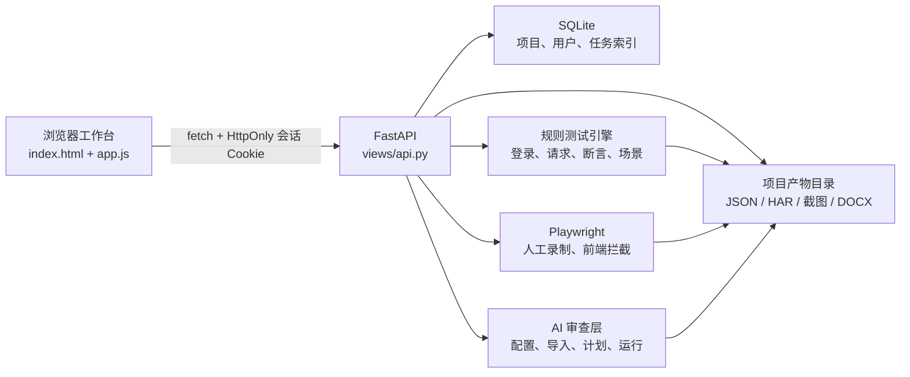
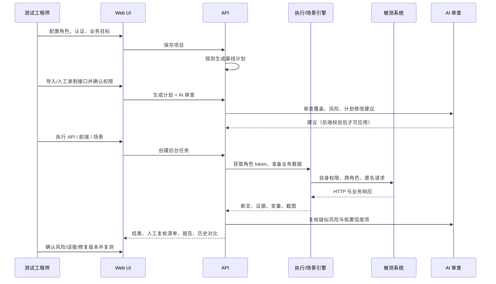
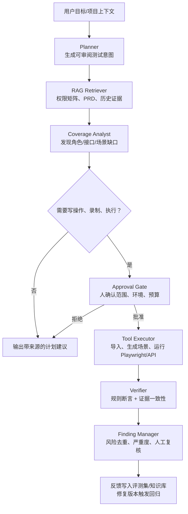

# IDOR Workbench 全量审阅、已修复事项与 RAG Agent 重构方案

> 审阅基线：2026-08-20（已完成第二轮缺陷复查）。本文区分“已验证/已修复”和“建议重构”，不把设计方案误称为已实现功能。

## 1. 当前系统是什么，数据如何流动

这是一个面向测开与安全测试团队的 IDOR（越权）测试工作台。当前形态是一个 FastAPI 单体服务加原生 HTML/CSS/JavaScript 前端：浏览器收集配置，后端将项目 JSON、计划、运行结果和 Word 报告分别落到 SQLite 元数据表与 `data/projects/<project_id>/` 目录。



### 1.1 前端的职责

`webapp/static/index.html` 是页面骨架，使用 `data-step` 定义“历史项目 → 基础配置 → 接口导入 → 执行计划 → 执行结果”的导航。`webapp/static/app.js` 的 `state` 保存浏览器临时状态；`collectProject()` 收集表单；`api()` 发送请求；各个 `render*()` 函数将后端数据映射回界面。`styles.css` 负责桌面三栏工作台和响应式布局。

前端的实际执行顺序如下：

1. 用户注册或登录，服务端写入 HttpOnly 会话 Cookie。
2. 用户填写项目、账号、鉴权、PRD/用例、接口和页面 URL；`collectProject()` 组装 JSON。
3. “保存项目”调用 `POST /api/projects`，收到 `project_id` 和规则基线计划。
4. 用户导入 HAR/Collection/cURL，或启动人工 Playwright 录制。导入结果合并到 `state.endpoints`，用户确认 `allowed_roles` 与 `page_url`。
5. “生成计划并 AI 审查”先调用 `/api/plan`，再调用 `/api/ai/analyze-plan`；AI 的修改仍需通过后端白名单校验。
6. “执行 API 测试/前端拦截”得到异步 `task_id`，`waitForTask()` 轮询 `/api/tasks/{task_id}`；完成后渲染结果、历史、下载入口。

### 1.2 后端的职责

`idor_workbench/views/api.py` 当前承担 HTTP 路由、文件解析、计划生成、任务入队和产物适配，文件规模过大，是后续拆分的首要目标。领域代码的职责是：

| 模块 | 当前职责 | 关键输入/输出 |
| --- | --- | --- |
| `foundation/database.py` | SQLite 数据访问、用户、会话、项目、任务、上传源文件 | 元数据，不保存大文件 |
| `domains/idor/execution.py` | 取 token、并发请求、组装原始结果 | `project` → `run_results.json` |
| `domains/idor/assertions.py` | 用状态码、业务码、响应数据判定 PASS/FAIL | 响应 + 断言 profile → verdict |
| `domains/idor/scenarios.py` | 步骤变量替换、JSONPath 提取、写操作安全开关 | 场景 → `scenario_results.json` |
| `domains/idor/frontend_probe.py` | 登录、注入 token、访问页面、截图和前端拦截判定 | 页面/角色 → `frontend_results.json` |
| `domains/idor/recorder.py` | headed Playwright 人工录制、HAR、页面来源证据 | 真实操作 → endpoints + HAR |
| `domains/idor/ai.py` | 配置/导入/计划/结果审查与本地规则回退 | 上下文 → 建议/风险 |
| `domains/idor/reporting.py` | 汇总运行产物为 Word 报告 | 结果 → `report.docx` |

### 1.3 从真实数据到结论的闭环



当前“最后一公里”尚不完整：AI 能给建议，但没有将“风险确认 → Jira/缺陷 → 修复版本 → 回归集合 → 评估指标”建模为可追踪对象。第 6 节给出补齐方式。

## 2. 本轮已验证的测试覆盖

以下均为真实执行结果，不是仅检查代码存在：

| 检查 | 结果 | 覆盖内容 |
| --- | --- | --- |
| `unittest discover -s tests` | 32 通过 | 断言、范围解析、页面推断、录制路由、场景、计划修改、项目授权、上传隔离/限流/文件名降级、产物脱敏 |
| `scripts/check_architecture.py` | 通过 | L3 → L2 → L1 依赖方向 |
| `scripts/quality.py` | 全部通过 | architecture、i18n、compileall、32 个单测、Ruff、Mypy、Vulture |
| `node --check webapp/static/app.js` | 通过 | 前端脚本语法 |
| `scripts/e2e_playwright_business_flow.py` | 通过 | 注册、DOM 注入防护、保存、角色、手工接口、人工录制入口、计划、AI 回退、API 任务 |
| `scripts/e2e_full_smoke.py` | 通过 | 空保存校验、PRD/CSV、HAR/Collection/cURL、按角色导入、搜索分页、API 运行、前端拦截、报告、产物下载、历史、删除 |
| 本轮新增安全回归 | 4 通过 | 跨账号项目/AI 访问拒绝、历史备注 PATCH、相同文件跨用户隔离、413 上传限流 |

两条 Playwright 链路运行期间，浏览器控制台没有 warning/error，所观察的 HTTP 响应没有 5xx。专项 DOM 用例向真实 `renderRunPage()` 注入 ``：脚本执行计数为 0，结果表中的 `img` 节点数为 0，恶意文本仍以普通文字展示。

浏览器在 390px 宽度下曾真实呈现为 180px 左栏 + 1043px 主区，主操作完全横向溢出；因此本轮加入了手机单栏 CSS。桌面版的三栏布局保留，表格仍在自身容器水平滚动。

## 3. 本轮已修改的代码与原因

### 3.1 项目资源越权防护（P0）

问题：旧代码只有项目的读取/删除/保存校验所有者；执行、前端检测、人工录制、任务状态、执行历史、报告下载、截图下载等路由只要猜到 `project_id` 即可访问或触发。这与 IDOR 测试平台自身的安全定位相矛盾。

修复：

- `views/api.py` 新增 `_require_owned_project()`。每个项目范围路由在读取目录、创建任务或写文件前都调用它；不属于当前用户统一返回 404，避免枚举项目 id。
- `_require_payload_project_access()` 覆盖 AI 审查和导入 cURL 等“可携带 project_id”的接口；无登录不能消耗 AI 或读取个人 AI 设置。
- 任务状态 `GET /api/tasks/{task_id}` 也按任务所属项目校验，不允许通过 task id 旁路。
- 历史备注路由改为 `PATCH /api/projects/{project_id}/runs/{run_id}`，与前端 `saveRunNote()` 已经发出的 PATCH 一致，修复实际点击保存时报 405 的断点。

### 3.2 上传源文件的归属和路径完整性（P0）

问题：项目保存请求中 `source_files[].stored_path` 来自浏览器 JSON。即使路径限制在工作区内，攻击者仍可能伪造指向其他项目或其他内部文件的路径，然后让服务端复制进自己的项目。

修复：

- `source_files` 表新增 `owner_user_id`，启动时对旧 SQLite 自动迁移。
- 上传时记录上传者；已归档到项目的旧数据可以通过项目所有者兼容访问。
- `_canonicalize_project_sources()` 只接受服务端已登记、且当前用户可访问的 `source_id`，并用服务端的 `stored_path` 替换浏览器值。函数内的注释说明了这个“服务端能力 ID”边界。

### 3.3 SQLite 连接生命周期（P1）

问题：`with sqlite3.Connection` 只提交/回滚事务，**不会关闭连接**。并发运行和 TestClient 测试均产生 `ResourceWarning`，Windows 上还可能让数据库或项目删除被句柄占用。

修复：`WorkbenchDB.connect()` 改为 `@contextmanager`。所有既有 `with self.connect() as conn:` 自动复用新语义，提交、回滚、关闭都由同一处处理。注释解释了为什么不能只依赖 sqlite 的原生上下文管理器。

### 3.4 可用性和回归

- `styles.css` 添加 `max-width: 780px` 的单栏响应式布局，修复小屏横向溢出；导航可横向滑动，内容卡片/表单折为一列，记录面板变为页底正常区块。
- `scripts/e2e_full_smoke.py` 增加“填写并点击保存历史备注、读取界面确认已保存”的真实浏览器断言，避免前后端方法再次漂移。
- `tests/test_project_route_authorization.py` 新增跨账号拒绝、任务拒绝和 PATCH 持久化的回归测试。
- `generated_config.py` 不再导出角色密码，改为 `IDOR_ROLE_<ROLE>_PASSWORD` 环境变量引用，并新增泄密回归测试；注意当前项目 JSON 仍是明文，生产化需要 Vault/KMS 迁移。

### 3.5 第二轮：上传隔离、限流与 AI 接口契约

第二轮发现旧上传实现把内容 SHA256 同时当作全局身份和物理文件名。两个用户上传相同内容时会命中同一个 `source_id`/文件：后上传用户不能合法引用它，而删除或归档又可能影响另一用户。现在的边界是：

- 物理目录固定为 `data/uploads/<owner_user_id>/<kind>/`，目录中的文件名使用时间戳和随机 UUID；相同内容也必须拥有独立 `source_id` 与独立物理文件。
- SHA256 只作为证据完整性元数据 `content_sha256`，不再承担授权身份。用户采用上传文件时仍只提交服务端签发的 `source_id`，后端再按 `owner_user_id` 查权。
- 上传采用 1 MiB 分块流式写入，累计超过 `IDOR_MAX_UPLOAD_BYTES`（默认 50 MiB）立即返回 413，并删除未完成临时文件，避免先把任意大文件完整写入内存或磁盘。
- `/api/ai/test` 的项目鉴权移到网络异常捕获之外。401/404 继续保持 HTTP 状态，不再被宽泛 `except` 吞成一个 HTTP 200 的 `{ok:false}`。
- AI 网络请求移除硬编码 `verify=False`，默认验证 TLS，并可通过 `IDOR_AI_VERIFY_TLS=false` 只在明确的私有开发环境关闭；同时设置 `trust_env=False`，避免机器代理变量悄悄改变连通性测试路径。

### 3.6 第二轮：前端结果安全与重复结构清理

`app.js` 原先分别有两份 `loadRunHistory`、两份 `renderRunHistory`、两份 `loadRunForCompare`，以及三份 `summarizeComparedRun/renderRunCompare`。JavaScript 会静默采用最后一个函数，旧实现看似可用、实际永远不执行，维护者很容易修错代码。本轮删除前两套废弃实现，只保留具有搜索、差异过滤、历史备注和详情表格的最终版本。

执行结果表之前把 `role/section/status/method/path/name/http/verdict/confidence/failures/body_preview` 直接拼进 `innerHTML`。这些字段可能来自被测系统、导入文件或 AI，属于不可信输入。现在所有字段均先经过 `escapeHtml()`；CSS class 只由本地 PASS/ERROR/FAIL 分支生成。Playwright 的恶意 `` 用例已成为持续回归测试。

浏览器弹窗监听器也从“每个目标页重复 `page.on()`”改为“每个角色页面注册一次、每次探测清空消息列表”，避免监听器累积和重复 dismiss。请求录制回调则显式绑定当前 `captured/role/page`，消除循环闭包在异步事件触发时串角色的风险。

### 3.7 第二轮：质量门禁恢复为可执行标准

- `scripts/quality.py` 只扫描 `idor_workbench/webapp/tests/scripts`，不再把根目录临时脚本、缓存和用户辅助文件误算作产品源码。
- i18n 门禁不再对整个 3000 行 `app.js` 做 SHA256。它只签名中文 token：普通安全修复和结构调整可以提交；新增或改变中文硬编码仍会失败，并要求迁到 `window.t(key)`。
- 清理 Ruff 的导入、旧语法、闭包和未使用变量问题；修正 `python-docx` 的真实类型、AI 数值解析和 API payload 收窄。当前 Ruff、Mypy（33 个源码文件）和 Vulture 均为 0 问题。
- 当前 Starlette 的 `TestClient` 已转向 HTTPX2；开发依赖加入 `httpx2>=2.9.1,<3.0`，不再依赖弃用的兼容回退。应用运行时仍可继续使用既有 `httpx` 客户端，迁移范围不会被测试依赖强行扩大。

## 4. 审阅结论与优先级

| 优先级 | 发现 | 影响 | 当前处理 |
| --- | --- | --- | --- |
| P0 | 项目级路由未统一鉴权 | 测试账号、请求、报告、截图泄露或被触发 | 本轮已修复并测试 |
| P0 | 前端提交上传路径被信任 | 可跨项目/内部文件复制 | 本轮已修复并测试 |
| P1 | 历史备注 PATCH/POST 不一致 | 用户点击保存失败 | 本轮已修复并覆盖 E2E |
| P1 | SQLite 连接不关闭 | 文件句柄、删除失败、长运行不稳定 | 本轮已修复 |
| P1 | 相同内容的跨用户上传共享身份和物理文件 | 权限冲突、删除/归档互相影响 | 本轮改为用户目录、随机 source id，并覆盖回归 |
| P1 | AI 测试吞掉鉴权异常且关闭 TLS 校验 | 客户端误判状态，中间人风险 | 本轮已修复并测试 |
| P1 | `app.js` 存在三组重复的历史/对比渲染函数 | 后定义覆盖前定义，阅读和改动均容易误判 | 本轮已删除废弃定义 |
| P1 | API 层约 1700 行，混有解析、存储、鉴权、任务、计划 | 软编码、传值和测试边界不清 | 第 7 节的模块化迁移目标 |
| P1 | `project.json` 仍以明文保存角色密码 | 存储层泄漏风险 | 生成配置已改为环境变量引用；生产化必须迁至 Vault/KMS |
| P1 | 进程内 `ThreadPoolExecutor` | 重启丢任务，无法横向扩容、无法可靠重试 | 迁移 Redis + Celery/Arq/Temporal |
| P2 | 前端仍是单体原生 JS，直接操作 DOM | 大功能迭代时易引入状态错位/XSS | 当前结果表已转义且有浏览器回归；长期迁移 React + TypeScript |
| P2 | 中文文案仍大量位于旧 `app.js/index.html` | 无法完整切换语言，文案与逻辑耦合 | 门禁已恢复绿色；后续按模块迁到 `t(key)` |
| P2 | 质量告警曾长期失效 | 真实缺陷会被存量噪声淹没 | 本轮 Ruff/Mypy/Vulture 全绿，作为后续合并标准 |
| P2 | AI 是审查器，不是闭环 Agent | 无风险确认、缺陷、回归、知识沉淀的可追踪链路 | 按第 6 节重构 |

仍未在本轮内“伪装完成”的主要事项是：API 单文件拆分、角色密码迁移 Vault/KMS、可靠任务队列、React/TypeScript 前端，以及 Finding/Approval/Retest/RAG 业务闭环。这些属于架构演进，不应与已经修好的缺陷混为一谈。

## 5. 建议的前后端重构边界

不要一次性把现有可用工作台推倒。先采用“绞杀者”迁移：保留既有 API 兼容层，按领域推出新模块和新页面。

### 5.1 前端目标

推荐 React 19 + TypeScript + Vite + Ant Design（或企业已有设计系统），不是为了换技术栈，而是为了把状态、数据请求、表单校验和页面展示分开。

```text
apps/web/
  src/app/                    路由、Provider、权限守卫
  src/features/projects/      项目列表、编辑器、项目 API
  src/features/evidence/      PRD/用例/HAR/Collection 和证据状态
  src/features/test-plan/     计划、审批、版本差异
  src/features/execution/     任务状态、结果、复测、报告
  src/features/agent/         对话、事件流、人工批准队列
  src/shared/api/             OpenAPI 生成的类型客户端
  src/shared/ui/              统一表格、空态、风险标签、错误边界
```

- React Hook Form + Zod：表单在浏览器先校验，后端 Pydantic 再校验；两端契约由 OpenAPI 生成。
- TanStack Query：项目、运行历史、任务状态拥有缓存键和失效策略，不再由全局 `state` 手动同步。
- Zustand 仅保存 UI 状态（当前步骤、筛选项、局部草稿），不保存服务端真相。
- 长任务使用 SSE/WebSocket 推送 `queued/running/progress/succeeded/failed` 事件，替换轮询；断开重连后按 task id 补状态。
- 所有动态文本经 React 转义；需要富文本时采用白名单 Markdown 渲染，不拼接不可信 HTML。

### 5.2 后端目标

```text
apps/api/
  api/v1/                     HTTP DTO、鉴权依赖、OpenAPI
  application/                use case：CreateProject、RunSuite、ConfirmFinding
  domain/                     Project、Evidence、TestPlan、Finding、Run 聚合与规则
  infrastructure/             PostgreSQL、S3/MinIO、Redis、LLM、VectorStore、任务队列
  workers/                    API runner、browser runner、ingestion、agent
```

关键约束：路由层只做鉴权/DTO 转换；应用层只编排用例；领域层不依赖 FastAPI、SQLAlchemy、Playwright 或模型 SDK；基础设施通过端口（Protocol/Interface）注入。每个写操作携带 `actor_user_id`、`tenant_id`、`trace_id`，并写审计日志。

数据层建议 PostgreSQL（租户、项目、测试计划、执行、风险、批准、审计）+ MinIO/S3（HAR、截图、DOCX、原始响应加密存储）+ Redis（短状态、限流）+ Celery/Arq/Temporal（可靠任务）。SQLite 仅保留开发单机模式。

## 6. 带 RAG 的测试 Agent：真正的业务闭环

### 6.1 RAG 不是“把所有文件塞给模型”

知识库至少分为五类，每个 chunk 都要有 `tenant_id/project_id/source_id/version/acl/classification` 元数据：

1. 业务依据：PRD、权限矩阵、接口文档、用例、历史缺陷。
2. 运行证据：HAR、OpenAPI、录制路径、请求/响应摘要、截图、断言结果。
3. 测试资产：角色、资源归属规则、场景模板、断言 profile、已批准计划。
4. 组织知识：安全规范、误报判定标准、修复建议模板。
5. 反馈资产：人工确认的真阳性/误报、修复版本、回归结果、模型评测集。

入库链路为：文件病毒/格式检查 → OCR/解析 → 语义分块（按接口、角色、业务流程，不按固定字符数）→ PII/密钥脱敏 → Embedding → 向量索引 → BM25 索引 → 元数据 ACL。检索采用“ACL 过滤 → 混合召回（BM25 + vector）→ reranker → 上下文压缩”，每个答案返回来源、chunk id 和置信度。

### 6.2 Agent 图与工具边界



工具必须强类型、可审计、最小权限：`search_evidence`、`list_authorized_roles`、`draft_plan`、`run_readonly_suite`、`propose_write_scenario`、`start_manual_recording`、`create_finding`、`request_retest`。模型不能直接调用 shell、SQL 或任意 URL；高风险动作都生成 `ApprovalRequest`，由人批准后才产生一次性 capability token。

### 6.3 一个风险从发现到关闭的数据模型

```text
Finding
  id, tenant_id, project_id, rule_id, severity, status
  evidence_refs[], affected_roles[], affected_resources[]
  agent_reasoning_summary, source_citations[], confidence

ApprovalRequest
  id, action_type, payload_hash, approver, expires_at, decision

Retest
  id, finding_id, target_build, suite_version, execution_id, conclusion

FeedbackLabel
  finding_id, label(true_positive/false_positive/needs_more_evidence)
  reviewer, rationale, evidence_refs[]
```

状态机固定为：`draft → evidence_collected → needs_approval → executed → needs_human_review → confirmed/false_positive → remediation_tracking → retest_passed/retest_failed → closed`。这就是当前 AI 审查层缺失的闭环；没有这条状态机，就不能将“AI 说可能有问题”升级为企业可交付的安全测试结果。

### 6.4 评测、观测和安全

- 评测集：从已确认风险/误报中匿名化抽取，分别评估检索 Recall@k、计划覆盖率、工具选择准确率、风险 precision/recall、人工接受率、修复后回归命中率。
- 观测：每次 Agent run 记录 trace、prompt/template 版本、retrieval chunk、工具参数哈希、模型/embedding/reranker 版本、token/时延/成本、审批人和最终标签。可选 Langfuse/OpenTelemetry，但业务审计表是权威来源。
- 安全：每个检索与工具调用先做租户/项目 ACL；机密字段在入库前脱敏；密钥放 Vault/KMS；原始请求和响应按数据分级加密、设置保留期；模型输出经过结构化 JSON Schema 校验和内容安全策略。

## 7. 推荐交付节奏和验收标准

| 阶段 | 目标 | 必须验收 |
| --- | --- | --- |
| S0（立即） | 补齐本轮安全与稳定性修复 | 跨账号 API 100% 为 401/404；全量单测/E2E 绿；移动端无页面级横向溢出 |
| S1（1-2 周） | 写 DTO、OpenAPI、任务状态机、存量 lint 基线 | 新增/修改文件 ruff 与 mypy 0 告警；所有 API 有 Pydantic 请求/响应模型 |
| S2（2-4 周） | React/TS 新建项目、计划、运行页面 | 新旧 API 兼容；关键流程 Playwright 覆盖率 100%；无全局可变服务端状态 |
| S3（3-5 周） | Postgres/MinIO/Redis/可靠 Worker 与审计 | 重启可恢复任务；幂等；重试/超时/取消可测；压测下任务不丢失 |
| S4（4-6 周） | RAG ingestion、检索、引用、评测 | 回答 100% 可追溯来源；ACL 越权检索为 0；离线评测达标才上线 |
| S5（持续） | Agent 审批、风险闭环、反馈学习 | 写操作均有批准记录；confirmed finding 可关联修复/复测；指标看板可用 |

## 8. 面试前应掌握到什么程度

能展示项目不等于能胜任 AI 测试/测开岗位。达到下面“可独立解释并现场实现”的程度再投递更稳妥：

1. **测试与安全基础**：可以解释 RBAC/ABAC、多租户、水平/垂直越权；能设计“创建资源 → 换账号 → 访问/删除 → 清理”的场景，知道 200 不等于无越权。
2. **工程实现**：可独立写 FastAPI 的 DTO、依赖注入、认证授权、幂等任务、数据库事务和异常模型；能说明为什么项目 id 不是权限凭据。
3. **前端**：能用 TypeScript/React 写表单、表格、错误边界、轮询或 SSE；知道不要用字符串拼接不可信 `innerHTML`。
4. **自动化**：可用 Playwright 写稳定定位、等待、文件上传、多账号 storage state、网络断言、截图/trace；能解释 flake 的原因和治理方法。
5. **RAG**：能现场讲清 chunk、metadata filter、hybrid retrieval、rerank、citation、离线评测、prompt injection 和数据隔离；能解释向量检索为何不能替代权限校验。
6. **Agent**：能画出 planner/tool/approval/verifier/feedback 图，能说明哪些动作需要人审、如何做幂等和可恢复。
7. **系统设计**：能在 45 分钟内从需求画出 API、表、队列、对象存储、可观测性、限流和故障恢复方案，并说出权衡。

面试最低作品标准建议是：一个可部署环境、README 一键启动、含匿名/跨角色/跨租户 E2E、可查看 trace 的 Agent 演示、10 条以上人工标注评测样本、明确的已知边界。面试时先讲“风险如何被证据证明并闭环”，再讲模型；这是企业更关心的顺序。

## 9. 后续维护原则

- 先加测试再修 bug；每个前端点击都要断言网络状态和页面状态两部分。
- 不将真实 token、密码、API key 放入 JSON、日志、截图或生成代码；开发环境也使用脱敏样例。
- 不以“AI 建议”直接覆盖计划/场景/断言；所有可执行变更必须经过规则校验、风险分类和审批。
- 不通过忽略真实规则或刷新整文件 hash 来伪造质量门禁；文案基线只跟踪旧中文 token，Ruff/Mypy/Vulture 必须持续为绿。
